# Documentation for the project

This is the documentation for the project. It contains models.
Story details and other information about the project, like 
the game controls and available options and outcomes.

# Table of Contents

Most of the links are not working, they are placeholders for now
as I will add documentation for the project, they will become
relevant.

## Working links or in progress

- [Project Progress](#project-progress)
- [Diagrams](#diagrams)
  - [Activity Diagram](#activity-diagram)
  - [State Diagram](#state-diagram)
  - [Class Diagram](#class-diagram)
  - [Flowchart Diagram](#flowchart-diagram)

## Inactive links

- [CI/CD Pipeline](#ci-cd-pipeline)a
- [Testing](#testing)
- [Ideas](#ideas)
- [Story](#story)
    - [Outcomes](#outcomes)
    - [Endings](#endings)
    - [Characters](#characters)
    - [Locations](#locations)
- [Game Design](#game-design)
  - [Map](#map)
- [Game Mechanics](#game-mechanics)
  - [Controls](#controls)
  - [Options](#options)
  - [Items](#items)
  - [Entities](#entities)
  - [Actions](#actions)
  - [Combat](#combat)
  - [Inventory](#inventory)
- [Map](#map)
- [Entities](#entities)
- [Items](#items)

## Project Progress

A table with project progress measured as tasks.

| task            | status      | date      | updated   |
|-----------------|-------------|-----------|-----------|
| Create diagrams | in progress | 9/23/2024 | 9/24/2024 |

## Diagrams

### Activity Diagram

### State Diagram

The explore action will  change the state to the explore state, the interact action will change the state to
the interact state, the look at inventory action will change the state to the inventory
state, and the quit action will change the state to the quit state. The interact state
has the following actions: talk, take, use, back, attack. The explore state has the following
actions: go somewhere, go back. The inventory state has the following actions: list. 
The quit will force the game to end and the application to close.

### Class Diagram

**Core Classes**
* `Game` - *Main controller managing game flow*
* `Entity` - *Base class for all living beings*
* `Player` - *Specialized entity controlled by user*
* `Item` - *Interactive objects in the game world*
* `Location` - *Areas in the game world*
* `Story` - *Manages narrative and progression*
* `Action` - *Possible activities in game*
* `GameState` - *Tracks game progress and state*

**Attributes by Class**
* `Game`
  * *player*: Main player entity
  * *story*: Current story
  * *currentState*: Active game state
  * *isRunning*: Game activity status

* `Entity`
  * *name*: Entity identifier
  * *health*: Current health points
  * *maxHealth*: Maximum possible health
  * *currentLocation*: Current position
  * *isActive*: Activity status

* `Player` (extends Entity)
  * *inventory*: Carried items
  * *maxInventorySize*: Inventory capacity limit
  * *(inherits Entity attributes)*

* `Item`
  * *name*: Item identifier
  * *description*: Item details
  * *type*: ItemType value
  * *isCollectable*: Pickup status
  * *isUsable*: Usage status
  * *currentLocation*: Item position

* `Location`
  * *name*: Location identifier
  * *description*: Location details
  * *entities*: Present entities
  * *items*: Present items
  * *connectedLocations*: Linked locations
  * *isLocked*: Access status
  * *requiredKey*: Key item for unlocking

* `Story`
  * *title*: Story name
  * *introduction*: Opening narrative
  * *storyParts*: Story segments
  * *locations*: Available areas
  * *entities*: Present entities
  * *items*: Available items
  * *dialogues*: Conversation map
  * *availableActions*: Possible actions
  * *endings*: Possible conclusions
  * *currentPartIndex*: Story progress

* `Action`
  * *name*: Action identifier
  * *description*: Action details
  * *type*: ActionType value
  * *outcome*: Result description
  * *requirements*: Required conditions
  * *source*: Acting entity
  * *target*: Target entity
  * *itemUsed*: Required item

* `GameState`
  * *name*: State identifier
  * *description*: State description
  * *availableActions*: Current actions
  * *currentPart*: Active story segment
  * *flags*: State condition map

**Enumerations**
* `ItemType`
  * *KEY*: For unlocking
  * *WEAPON*: For combat
  * *CONSUMABLE*: Single-use
  * *QUEST_ITEM*: Story-related

* `ActionType`
  * *MOVEMENT*: Location changes
  * *INTERACTION*: Entity/object interaction
  * *USE_ITEM*: Item usage
  * *DIALOGUE*: Conversations
  * *COMBAT*: Fighting actions

**Key Methods by Class**
* `Game`
  * *initializeGame()*: Start setup
  * *processAction()*: Handle actions
  * *updateGameState()*: Update state
  * *endGame()*: Conclude game

* `Entity`
  * *move()*: Change location
  * *interact()*: Entity interaction
  * *getStatus()*: Status check
  * *takeDamage()*: Process damage
  * *heal()*: Recover health
  * *setLocation()*: Update position

* `Player`
  * *addItem()*: Add to inventory
  * *removeItem()*: Remove from inventory
  * *useItem()*: Use item
  * *getInventoryStatus()*: Check inventory
  * *canCarryItem()*: Check capacity

* `Item`
  * *use()*: Use item
  * *examine()*: Get details
  * *getInfo()*: Basic info
  * *setLocation()*: Update position
  * *onCollect()*: Collection behavior
  * *onUse()*: Usage behavior

* `Location`
  * *addEntity()*: Add entity
  * *removeEntity()*: Remove entity
  * *addItem()*: Add item
  * *removeItem()*: Remove item
  * *getAvailableItems()*: List items
  * *getConnectedLocations()*: List connections
  * *canEnter()*: Check access
  * *unlock()*: Process unlocking

* `Story`
  * *progressStory()*: Advance story
  * *getCurrentPart()*: Current segment
  * *getAvailableActions()*: List actions
  * *addStoryPart()*: Add segment
  * *checkTriggers()*: Check conditions
  * *getEnding()*: Get conclusion

* `Action`
  * *execute()*: Perform action
  * *checkRequirements()*: Validate conditions
  * *getDescription()*: Action details
  * *isAvailable()*: Check availability

* `GameState`
  * *updateState()*: Update state
  * *getAvailableActions()*: List actions
  * *getCurrentStatus()*: Get status
  * *setFlag()*: Set condition
  * *checkFlag()*: Check condition

**Key Relationships**
* Game contains one Player, Story, and GameState
* Player extends Entity
* Location contains multiple Entities and Items
* Locations connect to other Locations
* Story contains multiple Locations and Actions
* GameState tracks multiple Actions
* Items have one ItemType
* Actions have one ActionType
* Player carries multiple Items
* Entities and Items are in one Location

- [ ] All classes should implement appropriate error handling for invalid operations
- [ ] State changes should be monitored using an observer pattern
- [ ] Each class should maintain single responsibility principle
- [ ] Proper access modifiers should be used to ensure encapsulation
- [ ] Critical operations should include validation
- [ ] Consider adding a save/load system for game state persistence
- [ ] Implement proper cleanup for unused resources
- [ ] Add logging for debugging
- [ ] Consider adding a quest/objective tracking system
- [ ] Plan for future extensibility of item and action types

### Flowchart Diagram

The user will first start the game, then a story introduction will be displayed.
The user wil be asked for input, and the game will respond accordingly. There
are 3 choices the user can make, explore, interact, look at inventory and quit.
This will make the main game loop.

